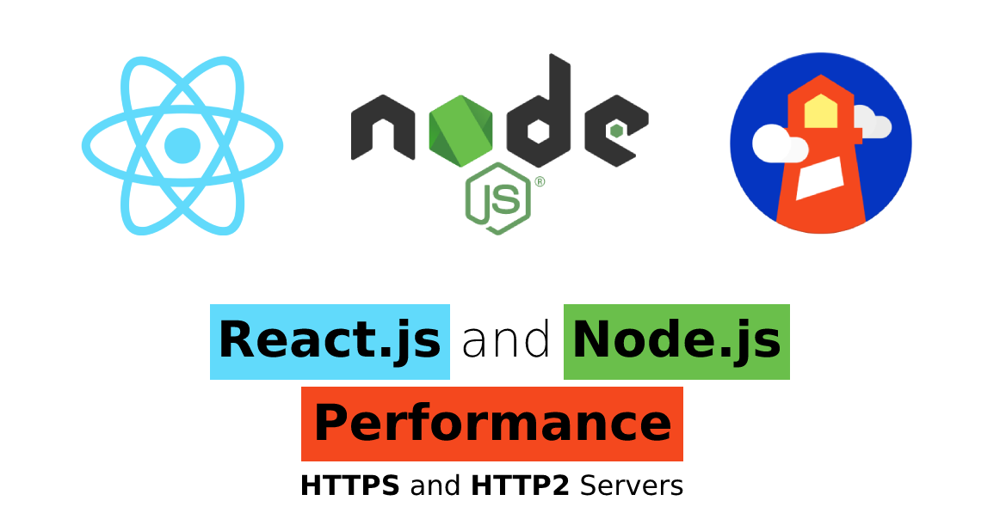

<p align="center">
  
</p>

<h1 align="center">Tutorial React.js and Node.js Performance (HTTPS and HTTP2 Servers)</h1>

<p align="center">With this tutorial you can check the performance of a React.js Application with a HTTPS and HTTP2 Node.js Servers.</p>

<p align="center">
  <a title="MIT License" href="LICENSE.md">
    
  </a>
  <a title="Twitter: JoseJ_PR" href="https://twitter.com/JoseJ_PR">
    
  </a>  
  <a title="Github: Sponsors" href="https://github.com/sponsors/JoseJPR">
    
  </a>
  <br />
  <br />
</p>

## 🔖 Description

🚀 HTTP/2 will make our applications faster, simpler, and more robust — a rare combination — by allowing us to undo many of the HTTP/1.1 workarounds previously done within our applications and address these concerns within the transport layer itself. Even better, it also opens up a number of entirely new opportunities to optimize our applications and improve performance!

[Google Developers | Introduction to HTTP/2](https://developers.google.com/web/fundamentals/performance/http2)
[Node.js HTTPS Documentation](https://nodejs.org/api/https.html) \
[Node.js HTTP2 Documentation](https://nodejs.org/api/http2.html) \
[React.js Website](https://es.reactjs.org/) \
[MDN Mozilla | MIME types](https://developer.mozilla.org/en-US/docs/Web/HTTP/Basics_of_HTTP/MIME_types) \
[Lighthouse Documentation](https://github.com/GoogleChrome/lighthouse/blob/master/docs/readme.md)

## 📹 Video Demo

The following video shows how you can check the difference between an https and http2 server with a react.js application.

[](https://youtu.be/Z6WznfaAcvQ)

## 📌 Methodologies and Guidelines

List of methodologies and tools used in this project for compliance with Quality Assurance Code (QAC)

* ESTlint, tool for identifying and reporting on patterns found in ECMAScript/JavaScript code. \
  [NPM ESLint](https://www.npmjs.com/package/eslint) \
  [NPM ESLint | Airbnb](https://www.npmjs.com/package/eslint-config-airbnb)

## ✅ Prerequisites

In order to work with this project, your local environment must have at least the following versions:

* NodeJS Version: 14.xx
* NPM Version: 7.10.0

## 📐 How to work with this project

This project is built on the basis of several workspaces: back, front and performance. After installing the dependencies you will find several folders "node_modules".

You have to do the following steps to be able to work with this project.

### 1️⃣ Install Nodejs Dependencies

```bash
$npm i
```

### 2️⃣ Build React.js Application

```bash
$npm run build
```

### 3️⃣ Run HTTPS Server and Performance Test

```bash
$npm run server-https
$npm run performance-https
```

### 4️⃣ Run HTTP2 Server and Performance Test

```bash
$npm run server-http2
$npm run performance-http2
```

## 📂 Code scaffolding

```any
/
├── assets 🌈               # Images Sources.
├── back 📁                 # Backend Project with https and http2 Node.js servers.
├── build 📦                # Frontend static compiled Application.
├── front 📁                # Frontend Project with React.js library.
├── performance 📁          # Performance Project Test with Lighthouse library.
├── reports 📊              # Html static files with performance results.
└── ...
```

## ⛽️ Review and Update Sependencies

For review and update all npm dependencies of this project you need install in global npm package "npm-check-updates" npm module.

```bash
# Install and Run
$npm i -g npm-check-updates
$ncu
```

## License

[MIT](LICENSE.md)

## Happy Code

Created with JavaScript, lot of ❤️ and a few ☕️

## This README.md file has been written keeping in mind

[GitHub Markdown](https://guides.github.com/features/mastering-markdown/) \
[Emoji Cheat Sheet](https://www.webfx.com/tools/emoji-cheat-sheet/)
